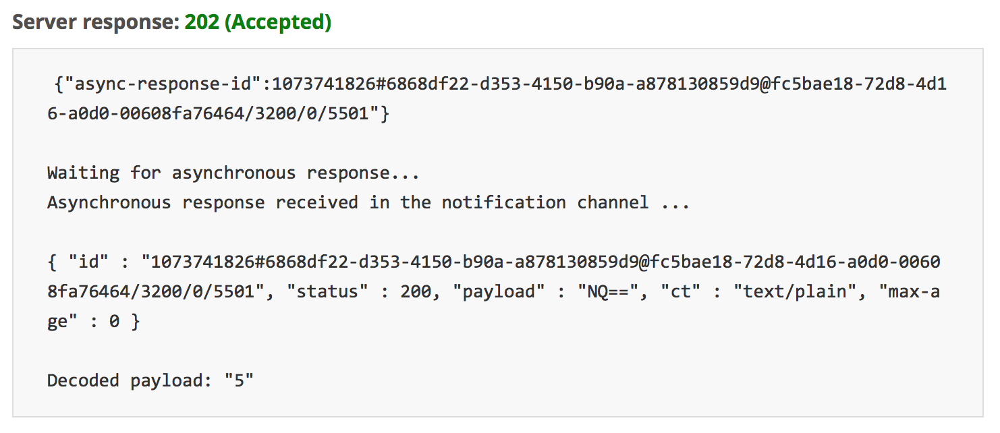

# Getting started with mbed Client on mbed OS

This is the mbed Client example for mbed OS (we also have one for [Linux](https://github.com/ARMmbed/mbed-client-linux-example)). It demonstrates how to register a device with mbed Device Connector, how to read and write values, and how to deregister. If you are unfamiliar with mbed Device Connector, we recommend that you read [the introduction to the data model](https://docs.mbed.com/docs/mbed-device-connector-web-interfaces/en/latest/#the-mbed-device-connector-data-model) first.

## Required software

* [ARM mbed account](https://developer.mbed.org/account/login/?next=/).
* [mbed-cli](https://github.com/ARMmbed/mbed-cli) - to build the example programs. To learn how to build mbed OS applications with mbed-cli, see [the user guide](https://github.com/ARMmbed/mbed-cli/blob/master/README.md).
* [Serial port monitor](https://developer.mbed.org/handbook/SerialPC#host-interface-and-terminal-applications).

The application:

* Connects to network with WiFi, Ethernet, 6LoWPAN ND or Thread connection.
* Registers with mbed Device Connector.
* Gives mbed Device Connector access to its resources (read and write).
* Records the number of clicks on the device’s button and sends the number to mbed Device Connector.
* Lets you control the blink pattern of the LED on the device (through mbed Device Connector).

## Application setup

To configure the example application:

1. [Select network and board](#select-network-and-board)
    * [Ethernet](#ethernet)
    * [Mesh (6LoWPAN and Thread)](#mesh)
    * [WiFi](#wifi)
    * [Non listed boards](#non-listed-board-support)
1. [Set the client credentials](#client-credentials).
1. [Set up an IP address](#ip-address-setup). This step is optional.
1. [Change the socket type](#changing-the-socket-type). This step is optional.

### Select network and board

This example supports following hardware-network combinations:

### Ethernet

#### Supported boards

* K64F
* NUCLEO_F429ZI
* UBLOX_EVK_ODIN_W2 (use the supplied `configs/eth_v4.json`)

For running the example application using Ethernet, you need:

- An Ethernet cable.
- An Ethernet connection to the internet.

### Mesh

There are example settings under the configs directory, which provide the easiest way to start with the applications. 
The [mbed-mesh-api](https://github.com/ARMmbed/mbed-os/tree/master/features/nanostack/FEATURE_NANOSTACK/mbed-mesh-api/mbed_lib.json)
defines the defaults settings for applications. The most relevant parameters are described in more detail in the following sections.

#### Supported boards

* K64F + NXP MCR20 15.4 shield (mesh `NANOSTACK_FULL` mode)
* [NUCLEO_F429ZI](https://developer.mbed.org/platforms/ST-Nucleo-F429ZI/) + [X-NUCLEO-IDS01A4](https://github.com/ARMmbed/stm-spirit1-rf-driver) Spirit1 6LoWPAN expansion board (mesh `LOWPAN_ROUTER` mode)
* NUCLEO_F429ZI + ATMEL AT233 15.4 shield (mesh `LOWPAN_ROUTER` mode)
* [Supported combinations of board and shields](#supported-combinations-of-board-and-shields)

First, you need to select the RF driver to be used by the 6LoWPAN/Thread stack. 

This example supports these shields:

* [AT86RF233/212B](https://github.com/ARMmbed/atmel-rf-driver)
* [NXP-MCR20a](https://github.com/ARMmbed/mcr20a-rf-driver)
* [X-NUCLEO-IDS01A4](https://github.com/ARMmbed/stm-spirit1-rf-driver) (*a.k.a.* Spirit1) radio shields. Check instructions for compilation [here](#compile-configuration-for-spirit1)

To select the radio shield make sure that the `mbed_app.json` file points to the correct radio driver type:

```json
    "mesh_radio_type": {
            "help": "options are ATMEL, MCR20, SPIRIT1",
            "value": "ATMEL"
        },
```

Then you need to enable ARM IPv6/6LoWPAN stack. Edit the `mbed_app.json` file to add `NANOSTACK` feature with the particular configuration of the stack:

```
"target.features_add": ["NANOSTACK", "LOWPAN_ROUTER", "COMMON_PAL"],
```

If your connection type is `MESH_THREAD` then you may want to use the `THREAD_ROUTER` configuration:

```
"target.features_add": ["NANOSTACK", "THREAD_ROUTER", "COMMON_PAL"],
```

Since 6LoWPAN ND and Thread use IPv6 for connectivity, you need to verify first that you have a working IPv6 connection. 
To do that, ping the Connector IPv6 address `2607:f0d0:2601:52::20` from your network.

#### Compile configuration for Spirit1

<span class="notes">**Note:** In case you want to use the STM Spirit1 Sub-1 GHz RF expansion board (X-NUCLEO-IDS01A4), you also need to configure its MAC address in the `mbed_app.json` file, for example:</span>

```json
    "target_overrides": {
        "*": {
            "spirit1.mac-address": "{0x0, 0x1, 0x2, 0x3, 0x4, 0x5, 0x6, 0x7}"
        },
    }
```

#### Channel settings

The default 2.4GHz channel settings are already defined by the [mbed-mesh-api](https://github.com/ARMmbed/mbed-os/tree/master/features/nanostack/FEATURE_NANOSTACK/mbed-mesh-api) to match the Border Router settings. The application can override these settings by adding them to the `.json` file. For example:

```json
    "target_overrides": {
        "*": {
            "mbed-mesh-api.6lowpan-nd-channel-page": 0,
            "mbed-mesh-api.6lowpan-nd-channel": 12,
            "mbed-mesh-api.thread-config-channel-page": 0,
            "mbed-mesh-api.thread-config-channel": 22
        }
    }
```

For sub-GHz shields ([Spirit1](https://github.com/ARMmbed/stm-spirit1-rf-driver) or AT86RF212B) use the following overrides, **6LoWPAN ND only**:

```json
"mbed-mesh-api.6lowpan-nd-channel-page": 2,
"mbed-mesh-api.6lowpan-nd-channel": 1
```

For more information about the radio shields, see [the related documentation](docs/radio_module_identify.md). 
 
=======
#### Supported combinations of board and shields

See Mesh-minimal's [Notes on different hardware](https://github.com/ARMmbed/mbed-os-example-mesh-minimal/blob/master/Hardware.md) for known combinations of development boards and RF shields that have been tested with mesh networking stack.

#### Border router

There are two options for border router.

##### Nanostack-border-router

You can configure and build the [nanostack-border-router](https://github.com/ARMmbed/nanostack-border-router) for the 6LoWPAN ND or Thread mode.

##### mbed gateway

The mbed gateway is a binary release only. Please note, the mbed gateway will not be supported after the mbed-os 5.5 release.

To connect the example application in 6LoWPAN ND or Thread mode to mbed Device Connector, you need to set up an mbed 6LoWPAN gateway router as follows:

1. Use an Ethernet cable to connect the mbed 6LoWPAN gateway router to the internet.
2. Use a micro-USB cable to connect the mbed 6LoWPAN gateway router to your computer. The computer will list the router as removable storage.
3. The firmware for the gateway is located in the `GW_Binary` folder in the root of this example. Select the binary matching your application bootstrap mode:

    * For the **6LoWPAN ND** bootstrap, use `gateway6LoWPANDynamic.bin`.
    * For the **Thread** bootstrap, use `gatewayThreadDynamic.bin`.

    The dynamic binaries use IPv6 autoconfiguration and enable the client to connect to the mbed Device Connector service. The static binaries create a site-local IPv6 network and packets cannot be routed outside.

4. Copy the gateway binary file to the mbed 6LoWPAN gateway router to flash the device. The device reboots automatically after flashing. If that does not happen, press the **Reset** button on the board.

You can view debug traces from the gateway with a serial port monitor. The gateway uses baud rate 460800. The gateway IPv6 address is correctly configured when the following trace is visible: `Eth bootstrap ready, IP=XXXX:XXXX:XXXX:XXXX:XXXX:XXXX:XXXX:XXXX`.

#### Thread-specific settings

With Thread, you can change the operating mode of the client from the default router mode to a sleepy end device by adding the following override to the `mbed_app.json` file:

```json
    "mbed-mesh-api.thread-device-type": "MESH_DEVICE_TYPE_THREAD_SLEEPY_END_DEVICE"
```

## WiFi

#### Supported boards

* UBLOX_EVK_ODIN_W2. Check instructions for compilation [here](#compile-configuration-for-odin-wifi).
* K64F + GROVE SEEED shield using [ESP8266](https://en.wikipedia.org/wiki/ESP8266) WiFi module.
* NUCLEO_F429ZI + GROVE SEEED shield using [ESP8266](https://en.wikipedia.org/wiki/ESP8266) WiFi module.

To run this application using ESP8266 WiFi Interface, you need:

1. An [ESP8266](https://en.wikipedia.org/wiki/ESP8266) WiFi module.
1. Updated [Espressif Firmware](https://developer.mbed.org/teams/ESP8266/wiki/Firmware-Update).
1. Mount the WiFi module onto [K64F Grove Shield v2](https://developer.mbed.org/platforms/FRDM-K64F/#supported-seeed-studio-grove-extension).
1. Attach the shield on your board.
1. In the `mbed_app.json` file, change:

```json
    "network-interface": {
        "help": "options are ETHERNET,WIFI,MESH_LOWPAN_ND,MESH_THREAD.",
        "value": "WIFI"
    }
```

Provide your WiFi SSID and password here and leave `\"` in the beginning and end of your SSID and password (as shown in the example below). Otherwise, the example cannot pick up the SSID and password in correct format.

```json
    "wifi-ssid": {
        "help": "WiFi SSID",
        "value": "\"SSID\""
    },
    "wifi-password": {
        "help": "WiFi Password",
        "value": "\"Password\""
    }
```

<span class="notes">**Note:** Some devices do not support the Grove Shield or use the primary UART for USB communication. On such devices, modify the `mbed_app.json` to use the serial pins connected to the ESP8266.</span>

For example, NUCLEO_F401RE requires a different serial connection:

```json
    "wifi-tx": {
        "help": "TX pin for serial connection to external device",
        "value": "PA_11"
    },
    "wifi-rx": {
        "help": "RX pin for serial connection to external device",
        "value": "PA_12"
    }
```

#### Compile configuration for ODIN WiFi

To compile ODIN WiFi configuration, you need to tell mbed NOT to compile the related files. To do that, set up a `.mbedignore` file. An example file is available in the `configs` folder.     

This should resolve the issue:

```     
cp configs/eth-wifi-mbedignore ./.mbedignore 
```    
 
### Non listed board support 

Apart from the listed configurations, this example can work on other mbed OS supported hardware boards which support any of the given network interface including Ethernet, WiFi, Mesh (6LoWPAN) or Thread, provided the configuration fulfills condition that the target hardware has TLS entropy implemented for it. On devices where hardware entropy is not present, TLS is disabled by default. This would result in compile time failures or linking failures.

To learn why entropy is required, read the [TLS Porting guide](https://docs.mbed.com/docs/mbed-os-handbook/en/5.2/advanced/tls_porting/).

Also, the complete example configuration of mbed Client, the selected network interface and mbed OS components must fit into hardware's given memory size (Flash size and RAM size). 

<span class="notes">**Note:** On non-K64F boards, there is no unregistration functionality and button presses are simulated through timer ticks incrementing every 15 seconds.</span>

<span class="notes">**Note:** To see how different targets are built please see the supplied `build_all.sh script`.</span>


### Client credentials

To register the application with the mbed Device Connector service, you need to create and set the client side certificate.

1. Go to [mbed Device Connector](https://connector.mbed.com) and log in with your mbed account.
1. On mbed Device Connector, go to [My Devices > Security credentials](https://connector.mbed.com/#credentials) and click the **Get my device security credentials** to get new credentials for your device.
1. Replace the contents in the `security.h` file of this project's folder with the content copied above.

### IP address setup

This example uses IPv4 to communicate with the [mbed Device Connector Server](https://api.connector.mbed.com) except for 6LoWPAN ND and Thread. However, you can easily change it to IPv6 by changing the `mbed_app.json` you make:

```
    "target_overrides": {
        "*": {
            "target.features_add": ["LWIP", "NANOSTACK", "COMMON_PAL"],
            "lwip.ipv4-enabled": false,
            "lwip.ipv6-enabled": true,
            "mbed-trace.enable": 0
        }
```

by modifying the `ipv4-enabled` or `ipv6-enabled` to `true/false`. Only one should be true.

The example program should automatically get an IP address from the router when connected over Ethernet or WiFi.

If your network does not have DHCP enabled, you have to manually assign a static IP address to the board. We recommend having DHCP enabled to make everything run smoothly.

### Changing the socket type

Your device can connect to mbed Device Connector via UDP or TCP binding mode. The default and only allowed value is UDP for Thread and 6LoWPAN. TCP is the default for other connections. The binding mode cannot be changed in 6LoWPAN ND or Thread mode.

To change the binding mode:

1. In the `simpleclient.h` file, find the parameter `SOCKET_MODE`. The default is `M2MInterface::UDP` for mesh and `M2MInterface::TCP` for others.
1. To switch to UDP, change it to `M2MInterface::UDP`.
1. Rebuild and flash the application.

<span class="tips">**Tip:** The instructions in this document remain the same, irrespective of the socket mode you select.</span>

Possible socket types per connection:

| Network  interface                    | UDP   | TCP | 
| ------------------------------|:-----:|:-----:|
| Ethernet (IPv4)               |   X   |   X   | 
| Ethernet (IPv6)               |   X   |       | 
| Wifi (IPv4)                   |   X   |   X   |
| Wifi (IPv6) - Not supported   |       |       |
| 6LoWPAN/Thread (IPv6)         |   X   |       |

## Building the example

To build the example using mbed CLI:

1. Open a command line tool and navigate to the project’s directory.

2. Import this example:

    ```
    mbed import mbed-os-example-client
    ```

3. To build the application, select the hardware board and build the toolchain using the command:

    (Specify the config file in the build command, for example for 6LoWPAN)

    ```
    mbed compile -m K64F -t GCC_ARM -c --app-config configs/6lowpan_Atmel_RF.json
    ```
    
    If you are using either of the following configurations remember to copy .mbedignore as well:
    
    ``` 
    configs/eth_*
    configs/wifi_*
    ```
    
    ```
    cp configs/eth-wifi-mbedignore ./.mbedignore 
    ```
    
    mbed CLI builds a binary file under the project’s `BUILD/` directory.

4. Plug the Ethernet cable into the board if you are using Ethernet mode.

5. If you are using 6LoWPAN ND or Thread mode, connect and power on the gateway first.

6. Plug the micro-USB cable into the **OpenSDA** port. The board is listed as a mass-storage device.

7. Drag the binary `BUILD/K64F/GCC_ARM/mbed-os-example-client.bin` to the board to flash the application.

8. The board is automatically programmed with the new binary. A flashing LED on it indicates that it is still working. When the LED stops blinking, the board is ready to work.

9. Press the **Reset** button on the board to run the program.

10. For verification, continue to the [Monitoring the application](#monitoring-the-application) chapter.

**To build the example using the Online IDE:**

Import this repository in the Online IDE and continue from step 3 onwards.

## Monitoring the application

The application prints debug messages over the serial port, so you can monitor its activity with a serial port monitor. The application uses baud rate 115200.

<span class="notes">**Note:** Instructions to set this up are located [here](https://developer.mbed.org/handbook/SerialPC#host-interface-and-terminal-applications).</span>

After connecting, you should see messages about connecting to mbed Device Connector:

```
Starting mbed Client example
[EasyConnect] IPv4 mode
[EasyConnect] Using Ethernet
[EasyConnect] Connected to Network successfully
[EasyConnect] IP address  192.168.8.110
[EasyConnect] MAC address 5c:cf:7f:86:de:bf

SOCKET_MODE : TCP

Connecting to coap://api.connector.mbed.com:5684

Registered object succesfully!
```

<span class="notes">**Note:** Device name is the endpoint name you will need later on when [testing the application](https://github.com/ARMmbed/mbed-os-example-client#testing-the-application).</span>

When you press the **SW2** button on your board you should see messages about the value changes:

```
handle_button_click, new value of counter is 1
```

## Testing the application

1. Flash the application.
2. Verify that the registration succeeded. You should see `Registered object successfully!` printed to the serial port.
3. On mbed Device Connector, go to [My devices > Connected devices](https://connector.mbed.com/#endpoints). Your device should be listed here.
4. Press the **SW2** button on the device a number of times (make a note of how many times you did that).
5. Go to [Device Connector > API Console](https://connector.mbed.com/#console).
6. Click the **Endpoint directory lookups** drop down menu.
     
7. In the menu, click **GET** next to **Endpoint's resource representation**. Select your _endpoint_ and _resource-path_. For example, the _endpoint_ is the identifier of your endpoint that can be found in the `security.h` file as `MBED_ENDPOINT_NAME`. Select `3200/0/5501`as a resource path and click **TEST API**. 
8. The number of times you pressed **SW2** is shown.
9. Press the **SW3** button to unregister from mbed Device Connector. You should see `Unregistered Object Successfully` printed to the serial port and the LED starts blinking. This will also stop your application. Press the **Reset** button to run the program again.

<span class="notes">**Note:** On non-K64F boards, there is no unregistration functionality and button presses are simulated through timer ticks incrementing every 15 seconds.</span>



<span class="tips">**Tip:** If you get an error, for example `Server Response: 410 (Gone)`, clear your browser's cache, log out, and log back in.</span>

<span class="notes">**Note:** Only GET methods can be executed through [Device Connector > API Console](https://connector.mbed.com/#console). For other methods, check the [mbed Device Connector Quick Start](https://github.com/ARMmbed/mbed-connector-api-node-quickstart).

### Application resources

The application exposes three [resources](https://docs.mbed.com/docs/mbed-device-connector-web-interfaces/en/latest/#the-mbed-device-connector-data-model):

1. `3200/0/5501`. Number of presses of **SW2** (GET).
2. `3201/0/5850`. Blink function, blinks **LED1** when executed (POST).
3. `3201/0/5853`. Blink pattern, used by the blink function to determine how to blink. In the format of `1000:500:1000:500:1000:500` (PUT).

To learn how to get notifications when resource 1 changes, or how to use resources 2 and 3, read the [mbed Device Connector Quick Start](https://github.com/ARMmbed/mbed-connector-api-node-quickstart).

## Known issues

### mbed OS 5.4

* [UBLOX_EVK_ODIN_W2]: This example is not compiling with IAR. See [#194](https://github.com/ARMmbed/mbed-os-example-client/issues/194)
* [NUCLEO_F429ZI]: This example is not compiling with IAR. See [#194](https://github.com/ARMmbed/mbed-os-example-client/issues/194)

Fix for those issues coming via; [mbed-os PR 3920] (https://github.com/ARMmbed/mbed-os/pull/3920)
