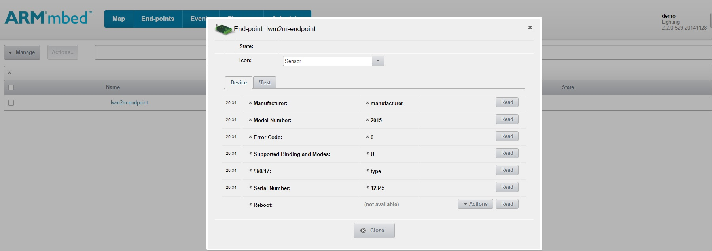
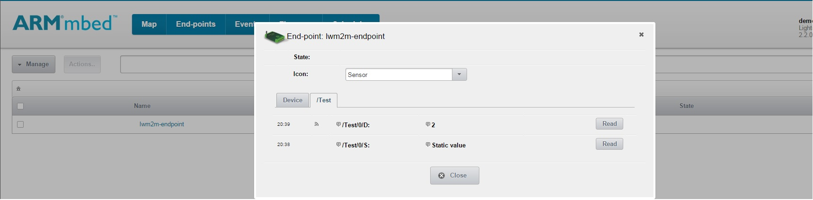
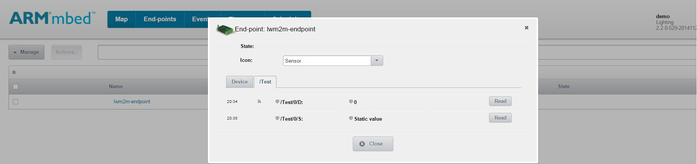

# Getting started on mbed Client Example

This document describes briefly the steps required to start using the mbed Client example application on mbed OS. The mbed Client example application demonstrates how to register, unregister, read resource values and send resource observations to the mbed Device Server.

## Required hardware
* An [FRDM-K64F](http://developer.mbed.org/platforms/frdm-k64f/) board
* An ethernet connection to the internet
* An ethernet cable
* A micro-USB cable

## Required software

* [Yotta](http://docs.yottabuild.org/#installing) - to build the example programs.
* [mbed Device Server (mDS)](#download-mbed-device-server-mds) - mbed Device Server, where mbed client example connects. 

## Optional software
* [Wireshark](https://www.wireshark.org/) - for packet inspection/network debugging.

## Setting up the environment
To set up the environment, you will need to do the following:

1. Download and run mDS server on computer.
2. Configure the mbed Client example program with the server address.
3. Build the application with Yotta.
4. Load the application to the FRDM-K64F board.
5. Plug the ethernet cable to the board.
6. Verify that the board communicates with the server.

**Note:** You might need to open UDP port 5683 and 5684 in your computer firewall for mDS to communicate with this example application.

### IP address setup

This example uses IPV4 to communicate with the mbed Device Server(mDS). The example program should automatically get an IPV4 address from the router when connected via ethernet.

If your network does not have DHCP enabled, you have to manually assign a static IP address to the board. We recommend having DHCP enabled to make everything run smoothly.

### Downloading mbed Device Server (mDS)

The example application will register to mbed Device Server. Install mDS on your local computer.

1. The free developer version of the mbed Device Server is used with this example. Download it from [ARM silver](https://silver.arm.com/browse/SEN00).
2. Unzip the package on your local computer. You should see the following files:
NOTE: These instructions have been made for Device Server 2.4 release!
```
Device Server.tar.gz
Device Server Clients.tar.gz
Device Server Tools.tar.gz
Ref Apps.tar.gz
```

### Starting the mbed Device Server (mDS)

1. Go to the `bin` folder of the Device Server package that you downloaded.
2. Run the start script:
    - If you are using Linux OS, run the `runDS.sh` in a new shell.
    - If you are using Windows, run the `runDS.bat` in a new command prompt.
		
This starts the mbed Device Server on your system.
		
### Starting the WebUI (_Connected home_ reference app)		
1. Go to the `bin` folder in the `Connected-home-trial` reference app that you downloaded.
2. Run the start script:	
    - If you are using Linux OS, run the `runConnectedHome.sh` in a new shell.	
    - If you are using Windows, run the `runConnectedHome.bat` in a new command prompt.	
		
This starts the WebUI on your system.	
		
## mbed Build instructions		
		
### Building
You can use this example in any of the following three connection modes:

1. Non-secure mode
2. DTLS PSK mode (**NOT SUPPORTED in this release**)
3. DTLS Certificate mode (**NOT SUPPORTED in this release**)

The general instructions for all modes are the same. The only difference comes in step 7, when selecting the mode.

#### General 
1. Connect the FRDM-K64F board to the internet using the ethernet cable.
2. Connect the FRDM-K64F board to the computer with the micro-USB cable. Make sure that you are using the micro-USB port labled **OpenSDA**.	
3. Install Yotta. See instructions [here](http://docs.yottabuild.org/#installing).
4. Install the necessary toolchains (`arm-none-eabi-gcc`). Refer to the yotta installation instructions (in step 3) to learn how to install the toolchains.
5. In the command prompt, `cd` **examples** and **mbed-client-examples**.
6. Open file `main.cpp`, edit your mbed Device Server's Ipv4 address in place of `coap://<xxx.xxx.xxx.xxx>`. For example, if your server's IP address is `192.168.0.1`, you would enter `coap://192.168.0.1`.
7. Select connection mode from below
8. Set up the target device, `yotta target frdm-k64f-gcc`.
9. In the command prompt, type `yotta build`. The binary file will be created to `/build/frdm-k64f-gcc/source/` folder.

**Note:** If the Device Server does not respond to _Client hello_ in secure connection modes, check your settings and restart the Device Server and the WebUI.

#### Non-secure
1. Set the `CONN_MODE` value to `M2MSecurity::NoSecurity`.
2. Set `MBED_SERVER_PORT` to `5683`.

#### DTLS PSK (NOT SUPPORTED in this release)
1. Set the `CONN_MODE` value to `M2MSecurity::Psk`.
2. Set `MBED_SERVER_PORT` to `5684`.

#### DTLS Certificate (NOT SUPPORTED in this release)
1. Set the `CONN_MODE` value to `M2MSecurity::Certificate`.
2. Set `MBED_SERVER_PORT` to `5684`.
3. Close the WebUI and Device Server and go to `<Device server>/conf/ `.
4. In the `deviceserver.properties` file, set `coap.dtls.psk` to `false`.
5. Restart the Device Server and WebUI.
6. In the browser, navigate to `https://localhost:8081/security.html` and give **admin** both as the username and the passsword.
7. Open the **Security** tab and upload `source/cert.pem` to the **Trusted certificates** list.

### Flashing to target device

1. Connect the FRDM-K64F board to the internet using an ethernet cable
2. Connect the FRDM-K64F board to your computer using a micro-USB cable. Make sure that you plug into the micro-USB port labeled **OpenSDA**, on the bottom of the board.
3. Find the binary file named `mbed-client-examples.bin` in the folder `mbed-client-examples/build/frdm-k64f-gcc/source/`. Drag and drop the file onto the `MBED` drive on your computer.

The board will be programmed when the LED stops flashing. Press the **RESET** button to run the program.

## Testing

### Logging network traffic (optional)

1. Start Wireshark on the computer where the mbed Device Server is running.
2. Select your ethernet interface, usually **Local Area Connection**.
3. Click **Start**.
4. Select the **Filter** field in the toolbar and add a filter to correspond to your mbed Device Server. Press Enter after you have entered the expression to activate the filter.
  - For example, if your server's IP address is `123.123.123.123`, you would enter `ip.addr == 123.123.123.123` and press Enter.
5. Power up your mbed board and press the **RESET** button.

You should see the endpoint after it has registered with the mbed Device Server.

### Testing the mbed Client example application with the mbed Device Server

Ensure that the mDS and the WebUI are running (see [Setting up the environment](#setting-up-the-environment)). Also, ensure that you have flashed the program to your mbed device (see [Flashing to target device](#flashing-to-target-device)).

**Step 1**: To open the WebUI, navigate to `http://localhost:8083`.
    - If you are working from a remote machine, you need to use the host machine's IP address instead of `localhost`.

**Step 2**: Enter `demo` as both the username and password.

**Step 3**: Go to the **End-points** tab. After a short time your device should appear in the list (refresh the page to update the list).


**Step 4**: Click the endpoint name to view the registered resources. 


**Step 5**: To make a CoAP request to node resources, click **Read**.



The **/Test** tab contains resources demonstrating dynamic and static resource functionality. 

The **/Test/0/D** represents the dynamic resource observed by the mbed Device Server. It is linked with the **SW2** button on the FRDM board. The value starts from zero and every time you press the **SW2** button the node sends a counter value to the mbed Device server, and it is updated to the UI without a need to press **Read**.



The **/Test/0/S** represents the static resource that is a fixed value set in the mbed Client. To make a CoAP request to the node resources, click **Read**. This returns the fixed value of _Static value_.



If you press the **SW3** button, the endpoint sends an unregister message to mbed Device Server. After a successful unregistration, LED **D12** starts blinking indicating that the application has successfully completed the task and the endpoint disappears from the endpoint list of the WebUI.
