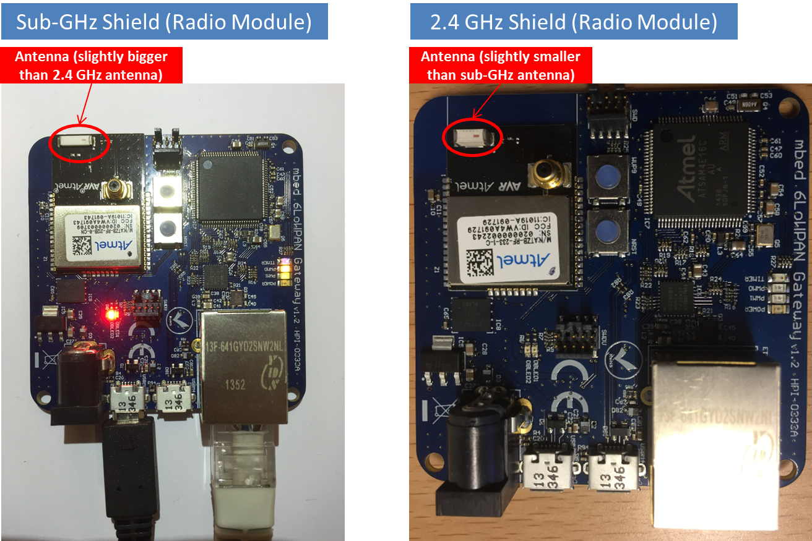

## Radio module identification

* Make sure that you are using the same radio modules on both server and client sides:

	* If the radio module on the gateway router supports the 2.4 GHz frequency band, the client side must have an mbed 6LoWPAN shield that uses a 2.4 GHz radio module (such as Atmel AT86RF233).

	* If the radio module on the gateway router supports the sub-GHz frequency band, the client side must have an mbed 6LoWPAN shield that uses a sub-GHz radio module (such as Atmel AT86RF212B).

* An easy way to identify which frequency band your setup uses is to check the **Antenna size** on the radio module:

	* The sub-GHz band antenna is larger than the 2.4 GHz antenna.

	* For the client side (mbed 6LoWPAN shield connected to an FRDM-K64F board), see the image below:
   

	* For the gateway router, see the image below:
   
